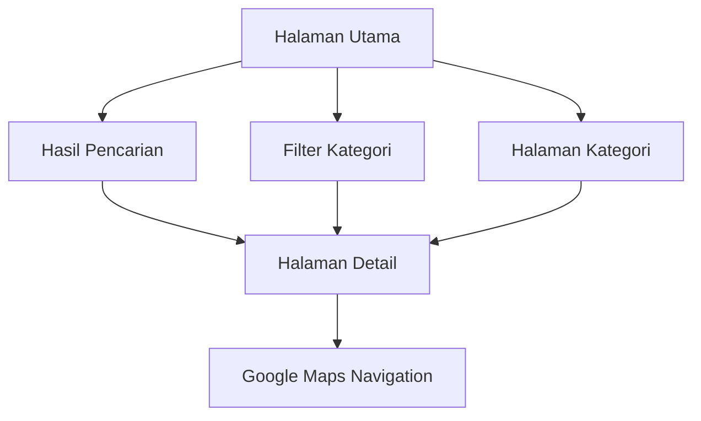

## 1. Product Overview
Website direktori cafe dan restoran yang menyediakan rekomendasi tempat makan terbaik berdasarkan rating dan review Google Maps. Pengguna dapat mencari, menelusuri, dan menemukan informasi lengkap tentang cafe/resto sebelum mengunjungi.

Membantu pengguna mengatasi kebingungan memilih tempat makan yang berkualitas dengan menyediakan data real-time dari Google Maps tentang rating, review, foto, dan lokasi. Target pengguna adalah pencinta kuliner, wisatawan, dan masyarakat umum yang mencari pengalaman makan yang terjamin kualitasnya.

## 2. Core Features

### 2.1 User Roles
Tidak memerlukan registrasi - website dapat diakses secara publik oleh semua pengguna.

### 2.2 Feature Module
Website direktori cafe/resto terdiri dari halaman utama berikut:
1. **Halaman Utama**: Daftar cafe/resto terbaik, pencarian, filter kategori, dan peta lokasi.
2. **Halaman Detail**: Informasi lengkap cafe/resto, galeri foto, review pengguna, dan peta interaktif.
3. **Halaman Kategori**: Pengelompokan cafe/resto berdasarkan jenis (Coffee Shop, Resto Keluarga, 24 Jam, dll).

### 2.3 Page Details
| Page Name | Module Name | Feature description |
|-----------|-------------|---------------------|
| Halaman Utama | Hero Section | Tampilkan headline "Temukan Cafe & Resto Terbaik di Kotamu" dengan background gambar cafe yang menarik. |
| Halaman Utama | Search Bar | Input pencarian berdasarkan nama tempat atau lokasi dengan autocomplete dan history pencarian. |
| Halaman Utama | Filter Kategori | Pilihan kategori: Coffee Shop, Resto Keluarga, 24 Jam, Makanan Indonesia, Western, Asian, cepat saji. |
| Halaman Utama | Sorting Options | Urutkan berdasarkan: Rating Tertinggi, Review Terbanyak, Terdekat, Termurah, Termahal. |
| Halaman Utama | Cafe/Resto List | Card-item yang menampilkan foto utama, nama, rating (bintang), jumlah review, kategori, alamat singkat, jam operasional, dan tombol "Lihat Detail". |
| Halaman Utama | Map View | Peta interaktif menampilkan marker lokasi cafe/resto dengan popup informasi singkat. |
| Halaman Detail | Header Info | Nama cafe/resto, rating besar dengan bintang, jumlah review, kategori, status buka/tutup. |
| Halaman Detail | Image Gallery | Galeri foto dari Google Maps dengan thumbnail dan view fullscreen, termasuk foto makanan, interior, eksterior. |
| Halaman Detail | Detail Informasi | Alamat lengkap, nomor telepon, website, jam operasional lengkap setiap hari, kisaran harga (RP signs). |
| Halaman Detail | Review Section | Daftar review terbaru dari Google Maps dengan nama reviewer, rating, tanggal, dan isi review. |
| Halaman Detail | Map Section | Peta interaktif besar dengan marker lokasi, tombol petunjuk arah, dan opsi share location. |
| Halaman Detail | Action Buttons | Tombol "Dapatkan Arah" (link ke Google Maps), "Telepon", dan "Bagikan" (share URL). |
| Halaman Kategori | Category Grid | Grid card kategori dengan icon dan jumlah tempat di setiap kategori. |
| Halaman Kategori | Category Filter | Daftar cafe/resto yang difilter berdasarkan kategori yang dipilih. |

## 3. Core Process
**User Flow - Pencarian Cafe/Resto:**
Pengguna mengunjungi Halaman Utama → Melihat daftar cafe/resto terbaik secara default → Menggunakan search bar untuk mencari nama atau lokasi → Menerapkan filter kategori jika diperlukan → Mengklik cafe/resto pilihan dari hasil pencarian → Masuk ke Halaman Detail untuk informasi lengkap → Melihat review, foto, dan lokasi → Mengklik "Dapatkan Arah" untuk navigasi ke Google Maps.

**User Flow - Eksplorasi Kategori:**
Pengguna mengunjungi Halaman Kategori → Memilih kategori (misal: Coffee Shop) → Melihat daftar cafe/resto dalam kategori tersebut → Membandingkan rating dan review → Mengklik item untuk detail lengkap.

## 4. User Interface Design

### 4.1 Design Style
- **Warna Utama**: Warm Brown (#8B4513) - menggambarkan nuansa kopi dan kehangatan cafe
- **Warna Sekunder**: Cream (#F5E6D3) dan White (#FFFFFF) - untuk background dan kontras
- **Accent Color**: Orange (#FF6B35) - untuk tombol CTA dan elemen penting
- **Button Style**: Rounded dengan shadow halus, hover effect berupa perubahan warna dan scale-up
- **Font**: Inter untuk heading, Open Sans untuk body text
- **Layout Style**: Card-based design dengan grid layout yang responsive
- **Icon Style**: Lucide React icons dengan outline style yang clean dan modern

### 4.2 Page Design Overview
| Page Name | Module Name | UI Elements |
|-----------|-------------|-------------|
| Halaman Utama | Hero Section | Full-width banner dengan background image cafe (blur effect), headline besar dengan font Inter 48px bold, subtext 18px regular, CTA button orange dengan icon search. |
| Halaman Utama | Search Bar | White background dengan border-radius 12px, shadow medium, placeholder text "Cari cafe atau resto...", icon search di kiri, tombol filter di kanan, tinggi 56px. |
| Halaman Utama | Cafe Card | Card dengan border-radius 16px, shadow medium, image aspect ratio 16:9, rating badge dengan background kuning dan bintang putih, nama cafe font 18px bold, alamat 14px gray, tombol action orange. |
| Halaman Detail | Header | Background gradient dari foto cafe (blur), nama cafe font 32px bold putih, rating besar 48px dengan bintang, status buka hijau/tutup merah. |
| Halaman Detail | Image Gallery | Grid 2x2 untuk thumbnail, border-radius 8px, hover zoom effect, tombol "Lihat Semua" untuk gallery modal fullscreen. |
| Halaman Detail | Map | Map container dengan border-radius 12px, shadow, tombol floating untuk fullscreen dan directions, marker cafe dengan logo coffee cup. |

### 4.3 Responsiveness
Desktop-first approach dengan breakpoint:
- Desktop: 1200px ke atas (grid 4 kolom untuk card)
- Tablet: 768px - 1199px (grid 2 kolom)
- Mobile: 320px - 767px (grid 1 kolom, card full-width)

Touch interaction optimization untuk mobile dengan:
- Swipeable image gallery
- Tap-friendly button (minimum 44px touch target)
- Sticky header dengan hamburger menu
- Bottom sheet untuk filter options di mobile