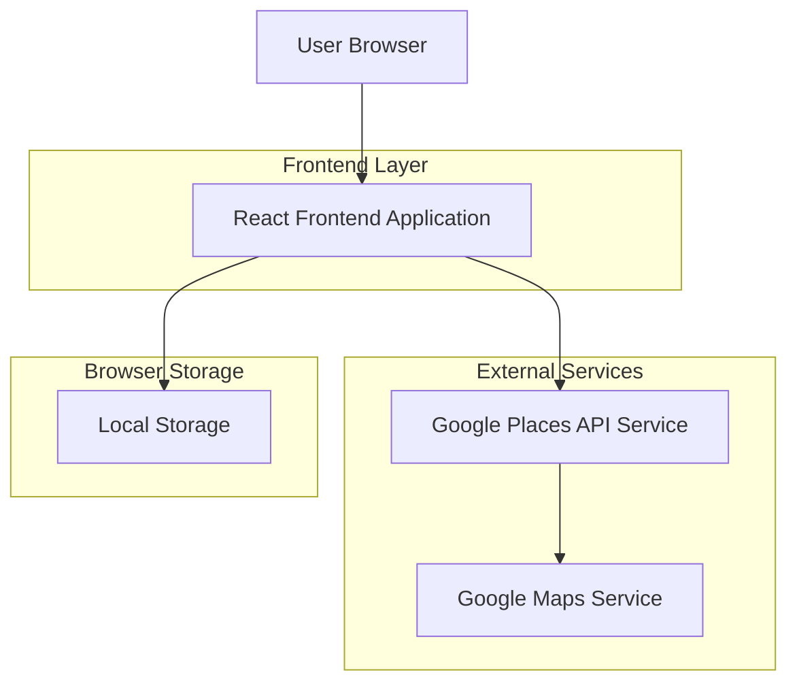
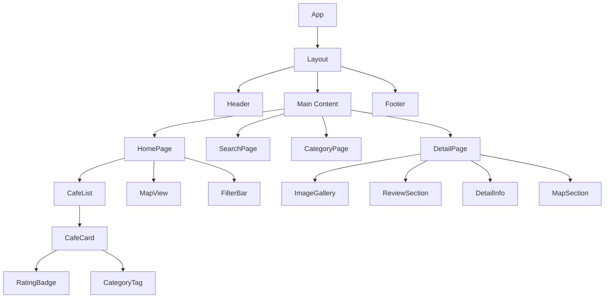

## 1. Architecture design



## 2. Technology Description

- **Frontend**: React@18 + tailwindcss@3 + vite
- **Initialization Tool**: vite-init
- **Backend**: None (Client-side application)
- **External APIs**: Google Places API, Google Maps JavaScript API
- **Icons**: Lucide React
- **State Management**: React Context + useReducer
- **HTTP Client**: Native fetch API

## 3. Route definitions

| Route | Purpose |
|-------|---------|
| / | Halaman utama dengan daftar cafe/resto terbaik |
| /category/:category | Halaman filter berdasarkan kategori |
| /search | Halaman hasil pencarian dengan query parameter |
| /cafe/:id | Halaman detail informasi cafe/resto tertentu |
| /about | Halaman informasi tentang website |

## 4. API definitions

### 4.1 Google Places API Integration

**Nearby Search API**
```
GET https://maps.googleapis.com/maps/api/place/nearbysearch/json
```

Request Parameters:
| Param Name | Param Type | isRequired | Description |
|------------|-------------|-------------|-------------|
| location | string | true | Latitude,longitude format |
| radius | number | true | Radius pencarian dalam meter |
| type | string | true | Tipe tempat: restaurant|cafe |
| key | string | true | Google API Key |
| rankby | string | false | prominence|distance |
| keyword | string | false | Keyword pencarian |

Response Structure:
```json
{
  "results": [
    {
      "place_id": "ChIJ1234567890",
      "name": "Kopi Kenangan",
      "rating": 4.5,
      "user_ratings_total": 1250,
      "vicinity": "Jl. Sudirman No.123",
      "types": ["cafe", "restaurant", "food"],
      "photos": [
        {
          "photo_reference": "Aap_uH123...",
          "width": 1920,
          "height": 1080
        }
      ],
      "opening_hours": {
        "open_now": true,
        "weekday_text": ["Senin: 07:00–22:00", ...]
      },
      "price_level": 2,
      "geometry": {
        "location": {
          "lat": -6.2088,
          "lng": 106.8456
        }
      }
    }
  ],
  "status": "OK",
  "next_page_token": "CqQCGwEAAK..."
}
```

**Place Details API**
```
GET https://maps.googleapis.com/maps/api/place/details/json
```

Request Parameters:
| Param Name | Param Type | isRequired | Description |
|------------|-------------|-------------|-------------|
| place_id | string | true | Unique place identifier |
| key | string | true | Google API Key |
| fields | string | false | Specific fields to return |

**Place Photos API**
```
GET https://maps.googleapis.com/maps/api/place/photo
```

Request Parameters:
| Param Name | Param Type | isRequired | Description |
|------------|-------------|-------------|-------------|
| photoreference | string | true | Photo reference from Places API |
| key | string | true | Google API Key |
| maxwidth | number | false | Maximum width in pixels |
| maxheight | number | false | Maximum height in pixels |

## 5. Data Model

### 5.1 TypeScript Interfaces

```typescript
interface Cafe {
  place_id: string;
  name: string;
  rating: number;
  user_ratings_total: number;
  address: string;
  category: CafeCategory[];
  photos: Photo[];
  opening_hours?: OpeningHours;
  price_level: PriceLevel;
  location: {
    lat: number;
    lng: number;
  };
  phone_number?: string;
  website?: string;
  is_open_now?: boolean;
}

interface Photo {
  reference: string;
  width: number;
  height: number;
  url?: string;
}

interface OpeningHours {
  open_now: boolean;
  periods: TimePeriod[];
  weekday_text: string[];
}

interface TimePeriod {
  open: {
    day: number; // 0-6
    time: string; // HHMM
  };
  close?: {
    day: number;
    time: string;
  };
}

enum CafeCategory {
  COFFEE_SHOP = 'coffee_shop',
  FAMILY_RESTAURANT = 'family_restaurant',
  FAST_FOOD = 'fast_food',
  INDONESIAN = 'indonesian',
  WESTERN = 'western',
  ASIAN = 'asian',
  OPEN_24H = 'open_24h'
}

enum PriceLevel {
  FREE = 0,
  INEXPENSIVE = 1,
  MODERATE = 2,
  EXPENSIVE = 3,
  VERY_EXPENSIVE = 4
}

interface Review {
  author_name: string;
  rating: number;
  relative_time_description: string;
  text: string;
  time: number;
  profile_photo_url?: string;
}

interface SearchFilters {
  category?: CafeCategory[];
  priceRange?: [number, number];
  rating?: number;
  openNow?: boolean;
  sortBy?: 'rating' | 'review_count' | 'distance' | 'price';
}
```

### 5.2 Local Storage Structure

```typescript
interface LocalStorageData {
  recentSearches: string[];
  favoriteCafes: string[]; // array of place_id
  lastLocation?: {
    lat: number;
    lng: number;
  };
  searchHistory: SearchHistory[];
}

interface SearchHistory {
  query: string;
  timestamp: number;
  resultsCount: number;
}
```

## 6. Component Architecture



## 7. Performance Optimization

- **Lazy Loading**: Gambar menggunakan lazy loading dengan Intersection Observer
- **Pagination**: Implementasi infinite scroll untuk daftar cafe
- **Caching**: Response API disimpan di browser cache dengan TTL 5 menit
- **Debouncing**: Search input dengan debounce 300ms
- **Image Optimization**: Google Place Photos dengan max-width 400px untuk thumbnail, 800px untuk detail
- **Bundle Splitting**: Code splitting per route menggunakan React.lazy()

## 8. Error Handling

- **API Errors**: Retry mechanism dengan exponential backoff
- **Network Offline**: Tampilkan cached data jika tersedia
- **Rate Limiting**: Implementasi request queue untuk menghindari limit Google API
- **Fallback UI**: Skeleton loading untuk cafe cards dan image placeholders